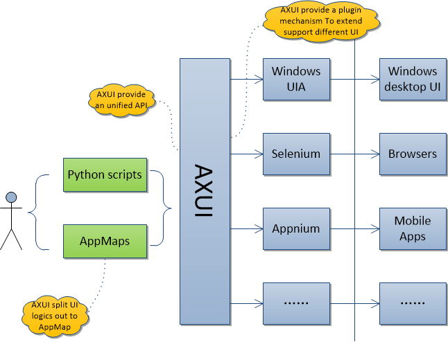

.. _`AXUI introduce`:

=========================
AXUI introduce
=========================

:Page Status: Development
:Last Reviewed: 

AXUI philosophy
=========================

Due to varies of reasons, writing and maintaining UI automation is easy to turn into a time cost/unpleasant task,
and becomes hard to reach the predefined automation goal, and eventually UI automation is give up and leave people a bad impression

Let's have a summary of these reasons:

1. UI is hard for programming, UI is a good/direct interface for people, but not a good interface for programming. On the contrary, CLI is good for programming.
   controlling UI is basically a inter process communication, typical step is:
   
   1. find the target UI with some UI special features
   2. control process/scripts send a request to UI
   3. check for response/state
   
   Potential problems in upper steps:
   
   - UI features used to find UI is not user friendly, some feature is not visible or have no meaning
   - UI control request is not user friendly, like a mouse/keyboard/touch event
   - UI could have lots of responses under different condition (UI change/no change/long time response/hang/crash), need to handle all of them

2. Tool support for UI automation is not easy to use, especially for PC platform due to there is a lot of UI frameworks on PC
   mainly problems for varies UI automation tools:
   
   - Different tool has different flavour of the programming language/style
   - Some tool is not powerful enough, but has no way to extend the function
   - There are a lot of tools, need good experience to select a proper tool to use
   
   .. note::
   
    There are a lot of good tools emerging, like `selenium <https://github.com/SeleniumHQ/selenium>`_ for web test automation, `appium <https://github.com/appium>`_ for smartphone automation

3. Testers are lack of programming skills to make test scripts robust and easy to maintain.
   Testers are responsible for test design and test execution.
   Thus, testers might not have enough coding skills to use complex libraries.
   Automation tools should be easy for testers to use, let testers focus their energy to improve test cases
      
AXUI is a collection of solutions for these problems::

1. AXUI provide a plug-in mechanism for automation guy to extend support for different UI
2. AXUI provide an unified, easy to use python interface for use in test scripts
3. AXUI separate UI logic from test scripts, make test scripts more readable and easier to maintain
4. AXUI provide mechanism to handle auto met UI automation issues, like UI response time 

To summarize, AXUI is to minimize the gap between testers and UI automation technologies.

AXUI structure
================

AXUI basically includes four modules, 
XML module to parse ``app map``, 
driver module to manage different drivers, 
interface module to provide testers an easy to use API, 
core module provides basic functions used by other modules

AXUI technologies details
================================

This section gives a brief introduce about some main features of AXUI

separate UI logic from test script
--------------------------------------

UI automation technologies often use a formatted string as identifier to find UI element, 
test scripts could contain a lot of these strings, makes scripts harder to understand and maintain.
AXUI separate these strings to a standalone XML file, we usually create a XML file for one app, and thus we normally call this XML file an ``app map``
An ``app map`` is just like a header file containing definitions, so scripts can reuse the definitions in ``app map``, no need to  string in scripts.

Here is a sample ``app map`` for windows media player::

    <AXUI:app_map xmlns:AXUI="AXUI" xmlns:xsi="http://www.w3.org/2001/XMLSchema-instance" xsi:schemaLocation="AXUI AXUI_app_map.xsd">

        <AXUI:includes>
            <AXUI:include name="desktop" path="windows_desktop.xml" />
        </AXUI:includes>

        <AXUI:funcs>
            <AXUI:func name="wmplayer_start" description="">
                <AXUI:step type="CLI" cmd='"C:\Program Files\Windows Media Player\wmplayer.exe"'/>
            </AXUI:func>
            
            <AXUI:func name="wmplayer_stop" description="">
                <AXUI:step type="GUI" cmd='wmplayer_Window.WindowPattern.Close'/>
            </AXUI:func>
        </AXUI:funcs>
        
        <AXUI:UI_elements>
            <AXUI:UI_element name="wmplayer_Window" parent="desktop.desktop" identifier="Name='Windows Media Player' OR Name='Now Playing' AND LocalizedControlType='window'" start_func="wmplayer_start" stop_func="wmplayer_stop">
                <AXUI:UI_element name="MenuBar" identifier="Name='Application' AND LocalizedControlType='menu bar'" start_func="wmplayer_ctrl_m">
                    <AXUI:UI_element name="File_MenuItem" identifier="Name='File' AND LocalizedControlType='menu item'" />
                    <AXUI:UI_element name="View_MenuItem" identifier="Name='View' AND LocalizedControlType='menu item'" />
                    <AXUI:UI_element name="Play_MenuItem" identifier="Name='Play' AND LocalizedControlType='menu item'" />
                    <AXUI:UI_element name="Tools_MenuItem" identifier="Name='Tools' AND LocalizedControlType='menu item'" />
                    <AXUI:UI_element name="Help_MenuItem" identifier="Name='Help' AND LocalizedControlType='menu item'" />
                </AXUI:UI_element>
            </AXUI:UI_element>
        </AXUI:UI_elements>
        
    </AXUI:app_map>

plug-in mechanism to extend support for different UI
-----------------------------------------------------

AXUI provide a plug-in mechanism to support extend other UI automation technologies to AXUI,
See :ref:`extend AXUI` 

other supports for UI automation
-----------------------------------------------------

AXUI provide other functions may used in UI automation, 

 - timeout mechanism to handle UI response time
 - image compare for UI verification
 - screenshot for every UI operation
 - multiple language support for internationalization 

AXUI interface
===============

AXUI restructure the original UI API into two parts, common operations like UI search is taken into AXUI internal, user should use ``app map`` to search UI element,
UI element specified operations like button invoke, set editor value is ported out directly, user can use original API to operate the UI element after UI element is found,
so AXUI can make code disciplined while not reducing the power of original API.

a simple example
==================

